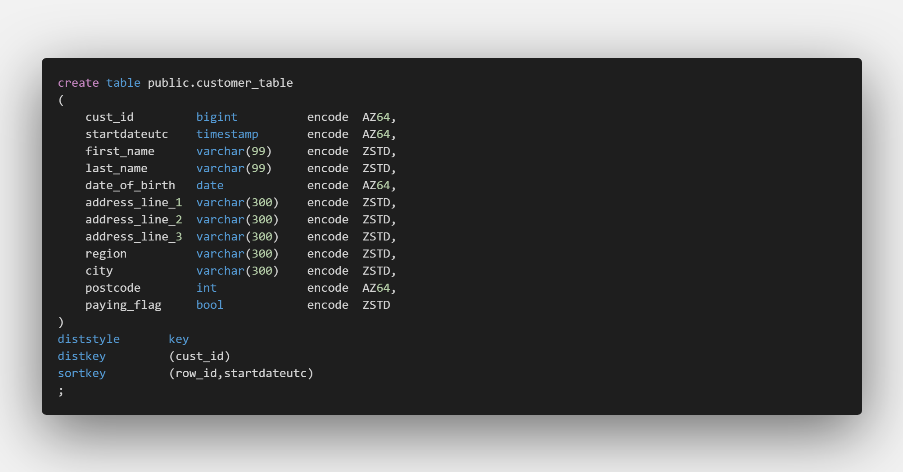

# SQL Test Script Generator

*For Redshift Table Builds*
## What is this?
This is a python script that reads a table build written in Redshift Syntax and then for every column outputs a text file with some basic test scripts.

## Why?
Part of thorough testing in SQL is ensuring that each column you have pulled through is operating as expected, this script quickly creates the basic tests you should run, leaving you to write more personalised tests. 

## Pre-requisites 
- Latest version of Python 3.0+
- Tables built using Redshift, will not (currently) work on tables built in Oracle, TSQL,Postgresql,MySQL etc.....

## Instalation / Configuration
1. Download the git as a Zip, you only really need 'Launch_Me.bat' and 'Gen_Test_Script.py'
2. Place these two files in the folder of your choosing
3. Edit 'Launch_Me.bat' and go to line 11
4. Edit 'C:/path to your python install/python.exe' to be where your python.exe is installed
5. Edit 'c:/path to this script/Gen_Test_Script.py' to be where you've stored this script
6. Providing the above is all done properly, then your done.

## How to Use 
1. Double Click 'Launch_Me.bat'
2. A CMD window will pop up AND and an empty notepad window
3. Highlight your create table statement (see below for acceptable format) and copy it into the notepad window.
4. Save and close the open notepad window.
5. Click on the open CMD window and hit enter
6. If you've configured it properly AND entered the right thing a text file should open up a text file with your test scripts.
7. A copy of that text file will be saved to the same folder you saved these scripts to

### Acceptable Table Format
In order for this script to work it needs to know what columns and what those columns data types are so it requires a full table build script to work, pictured below.

Create Table As, or INTO statements won't work and so if you do build your tables that way, in order to have your cake and eat it too, build your table then get your IDE (Aginity / Athena) to generate a table build DDL and then voila you'll have something that resembles the top picture. 

## How does this work? 
- It expects the DDL to be in the text file test_script_input.sql (CMD will generate this if it doesnt exist)
- It then exclusively reads the first row and reads the table name
- It then scans the entire statement for datatypes, i.e Int, Varchar this reduces the set to JUST the column names and their data types, throwing away everything else
- Then it reads every column name and it's data type and outputs to a text file a set of predefined tests for example:
  - If the data type was numeric i.e int/float/decimal it would output

- However if it reads a data type it doesn't recognize (or its read garbage) it will output an error message to the text file.
